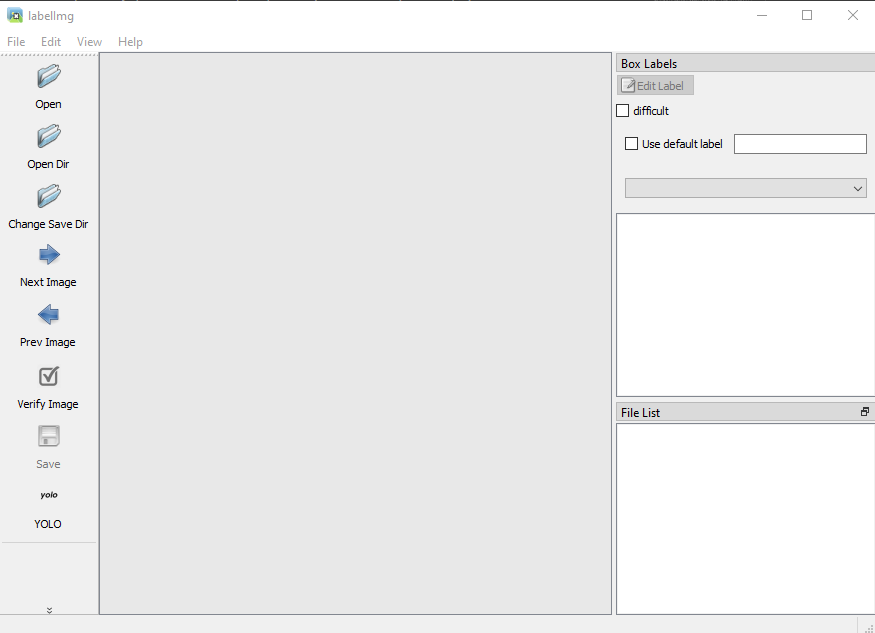
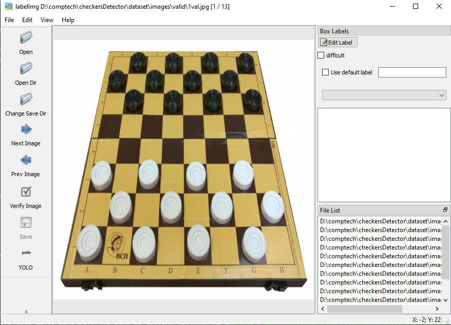
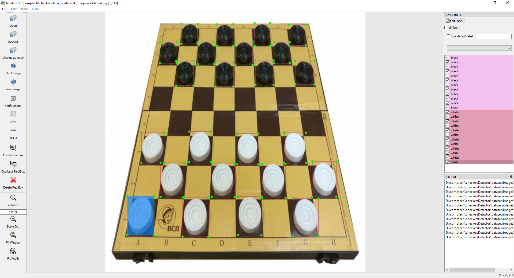

## Разметка для YOLO  
  
  
Привет, это краткая инструкция по разметке датасета для YOLOv5. Начнем с того, что поставим всё  
 необходимое  

Для начала нам нужен python, думаю, что у каждого МЛ инженера он уже есть на машине,  
но если это не так, то вприпрыжку бежим на официальный сайт и качаем его оттуда.  
К слову важно, чтобы при установке, вы нажали на галочку "add python to PATH"

После всех необходимых манипуляций нужно установить labelIMg. Делается это достаточно просто  
Открываем подходящую консоль (cmd/Powershell на винде, в зоопарке UNIX систем перечислять   
даже смысла нет, но думаю, если вы справились с её установкой, то терминал открыть сумеете :) )  
Теперь в консоли пишем  

`pip install labelImg`  

Важно отметить, что на некоторых системах вместо pip нужно писать pip3. Это зависит  
от того, как прописался python в путях.

Из внешних зависимостей это все, что нам нужно. Теперь нужно специальным образом   
организовать директорию датасета  

```
dataset/
    images/
        /train
            ...
        /valid
            ...
    /labels/
        /train
            ...
            classes.txt
        /valid
            ...
            classes.txt
    dataset.yaml
```
Теперь обо всем отдельно. Директория dataset самая внешняя, её вы потом заархивируете  
и поделитесь с миром :)

/images содержит все картинки, разбитые на тренировочную и тестовую выборку. Если вы  
никогда не составляли датасетов, то обычно всю имеющуюся выборку деляет в соотношении  
70% - тренировочная, 30% - тестовая. В нашем случае все тренировочные картинки лежат  
в папке /train, тестовые в /valid. 

/labels будет целевой папкой для labelImg. Её руками менять особо не нужно, в нее  
будет писать только labelImg.  

dataset.yaml это файл, который кормится wrapper'у YOLO. Он выглядит в точности так : 
```
train: D:\comptech\checkersDetector\dataset\images\train
val: D:\comptech\checkersDetector\dataset\images\valid

nc: 4
names: ['black','white','blackKing','whiteKing'] 
```
Думаю очевидно, что значения train и valid в этом файле специфичны для системы. При обучении  
их все равно поменяют, так что можете сильно не париться. А вот поля nc и names для нас важны.  
Первый - декларирует количество классов. Второй - описывает их названия. Очень важно, чтобы  
у вас совпадали названия классов, поэтому рекомендую оставить их такими, как в примере.

Теперь в обеих папках `/labels/train` и `/labels/valid` нам нужно создать одинаковый файл  
*classes.txt*. В котором пишем в таком же порядке

```
black
white
blackKing
whiteKing
```

Теперь можем перейти непосредственно к разметке. 

пишем в консоли 

`labelImg`

и видим интерфейс 


на месте, где у меня написано YOLO, у вас будет что то другое. Потыкайте, пока надпись на кнопке  
не будет YOLO. Дальше все просто. нажимем на кнопку openDir и в проводнике выбираем  
папку с картинками. После этого жмакаем кнопку change Save Dir и там выбираем соотвествующую  
папку. Соотвествующую здесь означает, что если вы выбрали картинки из директории  
`.../dataset/images/train`, то и для saveDir вы должен выбрать `.../dataset/labels/train`.  
Если картинки были из `.../dataset/images/valid` , то saveDir `.../dataset/labels/valid`. 

Если вы все сделали правильно, то на экране вы видите картинку. 


Нажимаем на кнопочку "w" и выделяем шашку. А выпадающем окне пишем один из классов,  
указанных ранее. То есть black,white,blackKing или whiteKing. Первые две - просто шашки  
соответствующего цвета. Вторые - это дамки того же цвета. Если вы все далаете правильно,  
то по завершение разметки у вас должно быть что то вроде такого: 


После этого гордо жмакаем конопку Save и NextImage, которая собственно  
выдаст вам новую картинку.

Советы по разметке:

1. Старайтесь, чтобы они были как можно ближе к шашке.
2. По возможности исключите персечения и наложения прямоугольников
3. Постарайтесь не опечатываться в названии класса. В идеале вообще копировать названия
